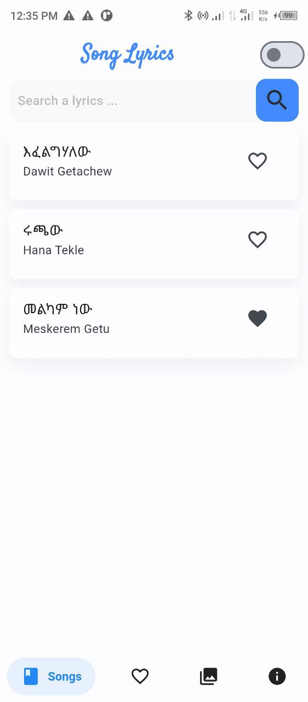
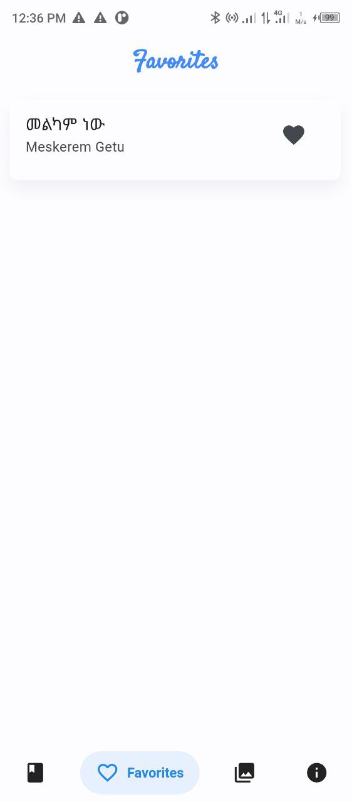
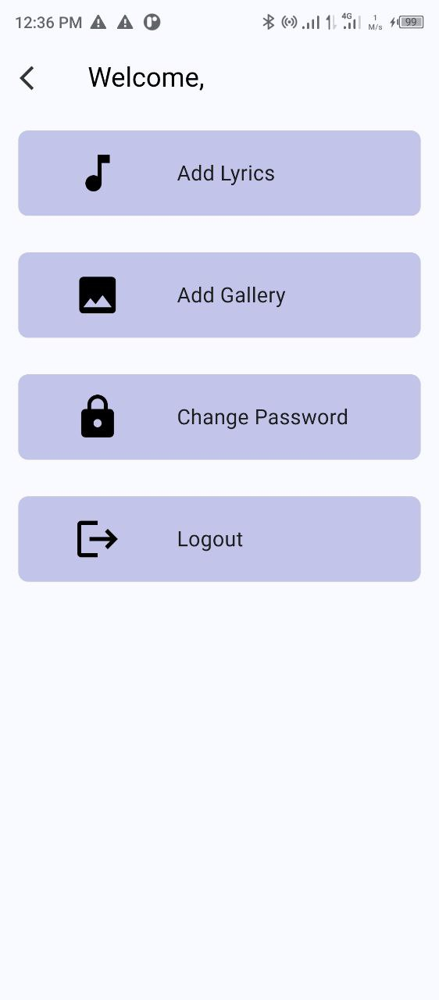

# Flutter Song Lyrics App

A Flutter application for managing song lyrics with Firebase integration and an Admin Portal for easy management of song data.

## Features

1. Listing Song Data from Firebase
2. Add/Remove from Favorites
3. Gallery
4. Admin Portal to add, delete, and update Songs and Gallery

## Screenshot Demo

<div style="display: flex; flex-direction: row;">
  
  
  
  
</div>

## Installation

Follow these steps to set up the project:

Clone the repository:

```bash
git clone https://github.com/gemechis-elias/flutter-song-lyrics-app.git 
```

Create a Firebase project:

- Go to the Firebase Console.
- Click on "Add project" and follow the instructions to create a new Firebase project.

Add Firebase to your Flutter app:

- Follow the steps outlined in the Firebase documentation to add Firebase to your Flutter project.

Enable User Authentication:

- In the Firebase Console, navigate to "Authentication" and enable the "Email/Password" sign-in method.
- Add a test user for admin access using their email and password.

Enable Firebase Realtime Database and Storage:

- In the Firebase Console, navigate to "Database" and select "Realtime Database".
- Follow the prompts to enable Realtime Database and select the testing mode.
- Similarly, navigate to "Storage" and enable it.

Import database structure:

- Import the database structure from assets/song-lyrics-app-export.json to your Firebase Realtime Database.

## Contribution:

Contributions are welcome! Here's how you can contribute 😊:

1. Fork the repository.
2. Clone the forked repository to your local machine.
3. Create a new branch for your feature or bug fix.
4. Make your changes and commit them with descriptive commit messages.
5. Push your changes to your forked repository.
6. Submit a pull request to the main repository.

## License:

This project is licensed under the MIT License. Feel free to use and modify it according to your needs. Contributions are appreciated.
